# Exploitability Test

## Self-Play

### SlimeVolley-v0

We exploit the models trained with self-play using the exploiter model, which has the same basic settings (network architecture, optimizer, learning hyper-parameters, etc) as the trained ones. To demonstrate the improved exploitability via self-play, we compare two models: a 'good' model (trained for 5000 episodes via self-play, converge to some almost unexploitable policy) and a 'bad' model (trained for 500 episodes via self-play). For exploiting the two models, the exploiter is trained via RL setting for 2000 episodes. In experiments, we set the trained model as 'first_0' player and the exploiter as 'second_0' in *SlimeVolley-v0* environment.

**Exploit the Bad Model**:

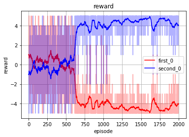
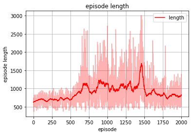
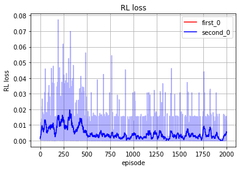

**Exploit the Good Model**:

Exploit for 2000 episodes: 

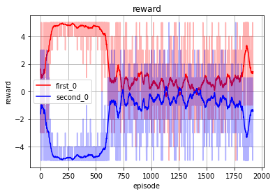
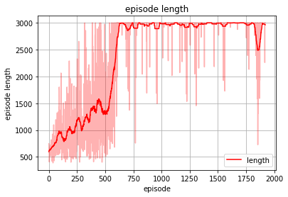
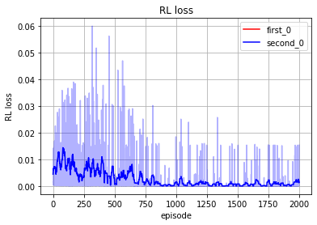

Exploit for 10000 episodes: 

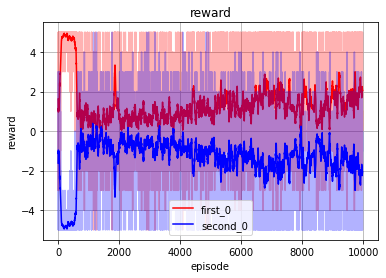
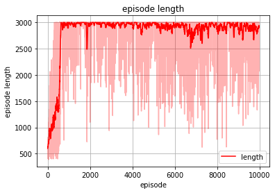
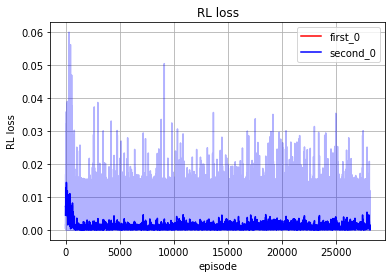

**Observations**:

* The good trained model is significantly harder to be exploited by the exploiter, compared with the bad model. It can be seen that for the good model, 'second_0' almost never reach >0 reward value during the whole training process. Even if the it is exploited for longer time (from 2000 to 10000 episodes), it is still hard to be exploited.
* At the initial training stage of the exploiter against the good model, the relatively high reward of the exploiter is probably caused by its atypical behavior due to the learning from scratch setting, while the good model in its lastest self-play stage is playing against an opponent also with good performance.
* The large episode length in the learning of exploiter against the good model shows that the two players both reach some high-performance behaviors, but the exploiter can sill not exploit the good model with positive reward. For the bad model, the episode length is not that high because the bad model is so easier to exploit without the need of playing a full episode of the game. 

**Large Model**:

Considering a large model, which has hidden nodes [1024, 1024, 1024, 1024] instead of [64, 64, 64] used in above tests, we also train the model to almost converge (a significant longer time for new tournament) with self-play. Then we exploit the large model with a small model ([64, 64, 64]) used before, the results look like:

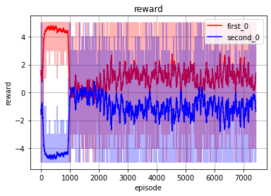
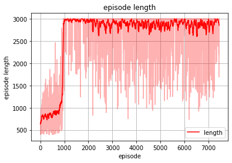
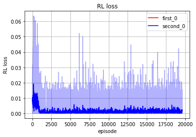

### PettingZoo Boxing-v1
We also exploit a 'good' model trained with self-play on PettingZoo *Boxing-v1* environment. The exploitation is conducted for long enough time (10000 episodes).

**Exploit the Good Model**:

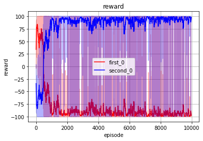
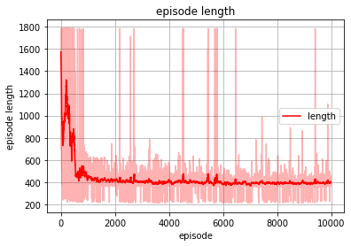
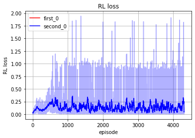

We see from the above images, the good model is also easily to be exploited in this environment.

## Nash-DQN with Exploiter

### SlimeVolley-v0

The bad model is trained for 1000 episodes and the good model is trained for 3500 episodes, both with 5 parallel environments.

**Exploit the Bad Model**:

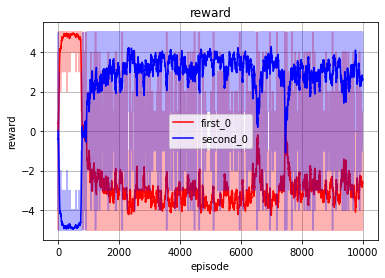
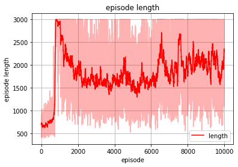
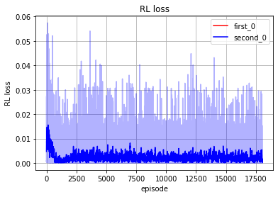

**Exploit the Good Model**:

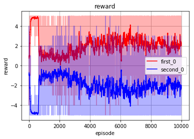
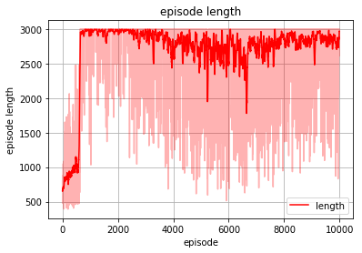
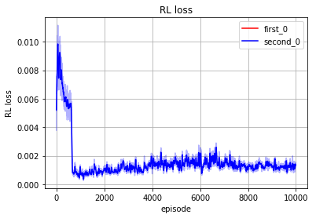

## Neural Fictitious Self-Play

### PettingZoo Boxing-v1

**Exploit the Bad Model (Average Policy)**:

The bad model is not trained.

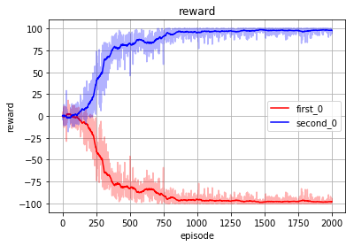
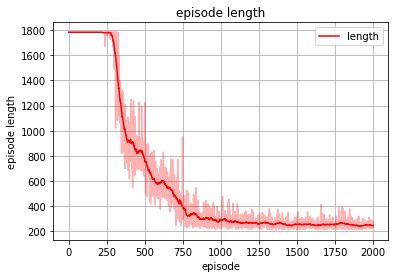
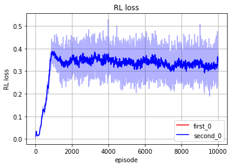

**Exploit the Good Model (Average Policy)**:

The good model is trained for 5000 episodes. Average policy is the average historical best response policy learned with SL.

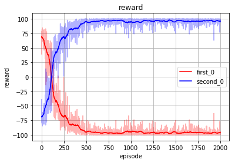
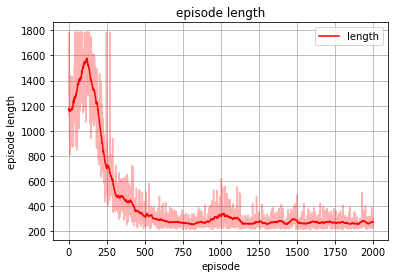
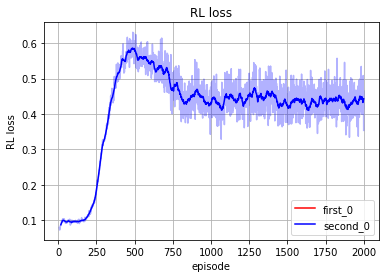

**Exploit the Good Model (Best Response Policy)**:

The good model is trained for 5000 episodes. Best response policy is the final best response policy learned with RL.

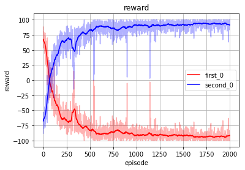
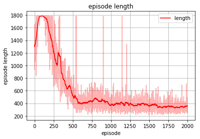
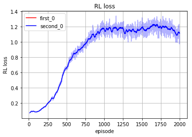

### LaserTag LaserTag-small3-v0

LaserTag environments have a fixed time horizon of 1000 timesteps. The environments are actually not zero-sum games, but general-sum ones. The reward for each timestep can be np.array([0, 0]) or np.array([1, 0]) or np.array([0, 1]), therefore not constant-sum (zero-sum). As shown in exploitation test, an improvement of the reward for one agent does not necessarily indicate an decrease of performance in another agent. Unlike the [original paper](https://arxiv.org/abs/1603.01121), which only evaluate the NFSP method on two-player zero-sum games, we also test it here on this general-sum game as done by [this repo](https://github.com/younggyoseo/pytorch-nfsp).

In NFSP training, both `1` and `2` agents are learned with an individual NFSP agent. In exploitation,  `1` is the NFSP agent and `2` is the exploiter.

**Train NFSP**:

Since the LaserTag environments have image observations, it typically requires a CNN backbone in either policy or value network. We tried two types of CNN architecture as following:

1. A standard CNN with channels [8, 8, 16], kernel sizes [4, 4, 4], strides [2, 1, 1], using ReLU hidden activation, and followed by a two-layer MLP of [32, 32]:

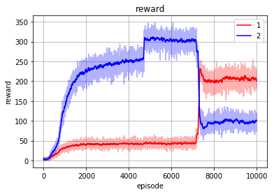

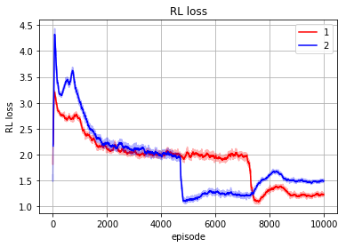

2. A CNN architecture borrowed from [IMPALA](https://arxiv.org/abs/1802.01561) with residual blocks inside, with the exact specification almost the same as [OpenAI baselines version](https://github.com/openai/baselines/blob/master/baselines/common/models.py), also followed by a two-layer MLP of [32, 32]:

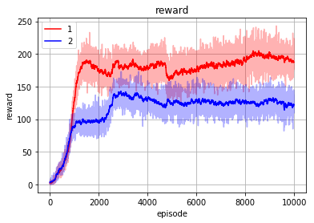
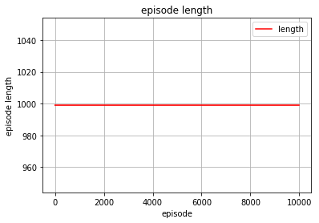
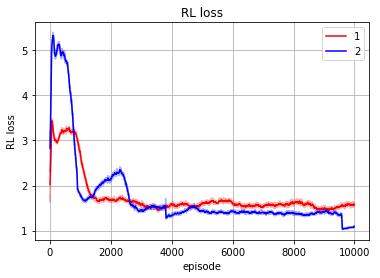

 The following exploitation tests are conducted on the first model (i.e., with standard CNN).

**Exploit the Bad Model (Average Policy)**:

The bad model is not trained.

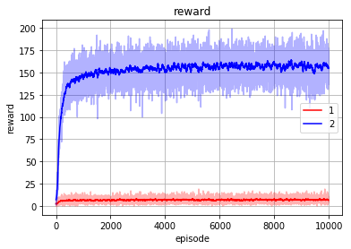

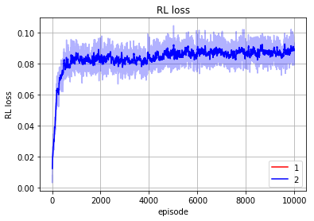

**Exploit the Good Model (Average Policy)**:

The good model is trained for 10000 episodes.

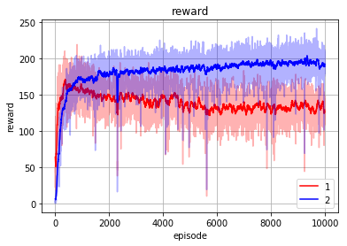

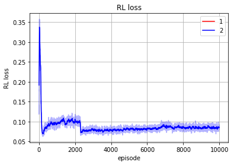

**Exploit the Good Model (Best Response Policy)**:

The good model is trained for 10000 episodes.

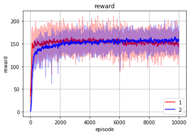

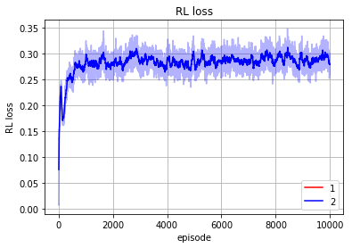

