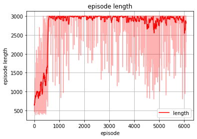

# Exploitability Test

## Self-Play

### SlimeVolley-v0

We exploit the models trained with self-play using the exploiter model, which has the same basic settings (network architecture, optimizer, learning hyper-parameters, etc) as the trained ones. To demonstrate the improved exploitability via self-play, we compare two models: a 'good' model (trained for 5000 episodes via self-play, converge to some almost unexploitable policy) and a 'bad' model (trained for 500 episodes via self-play). For exploiting the two models, the exploiter is trained via RL setting for 2000 episodes. In experiments, we set the trained model as 'first_0' player and the exploiter as 'second_0' in *SlimeVolley-v0* environment.

**Exploit the Bad model**:

**Exploit the Good model**:

Exploit for 2000 episodes: 

Exploit for 10000 episodes: 

**Observations**:

* The good trained model is significantly harder to be exploited by the exploiter, compared with the bad model. It can be seen that for the good model, 'second_0' almost never reach >0 reward value during the whole training process. Even if the it is exploited for longer time (from 2000 to 10000 episodes), it is still hard to be exploited.
* At the initial training stage of the exploiter against the good model, the relatively high reward of the exploiter is probably caused by its atypical behavior due to the learning from scratch setting, while the good model in its lastest self-play stage is playing against an opponent also with good performance.
* The large episode length in the learning of exploiter against the good model shows that the two players both reach some high-performance behaviors, but the exploiter can sill not exploit the good model with positive reward. For the bad model, the episode length is not that high because the bad model is so easier to exploit without the need of playing a full episode of the game. 

**Large Model**:

Considering a large model, which has hidden nodes [1024, 1024, 1024, 1024] instead of [64, 64, 64] used in above tests, we also train the model to almost converge (a significant longer time for new tournament) with self-play. Then we exploit the large model with a small model ([64, 64, 64]) used before, the results look like:

### PettingZoo Boxing-v1
We also exploit a 'good' model trained with self-play on PettingZoo *Boxing-v1* environment. The exploitation is conducted for long enough time (10000 episodes).

**Exploit the Good model**:

We see from the above images, the good model is also easily to be exploited in this environment.

## Nash-DQN with Exploiter

### SlimeVolley-v0

The bad model is trained for 1000 episodes and the good model is trained for 3500 episodes, both with 5 parallel environments.

**Exploit the Bad model**:

**Exploit the Good model**:

