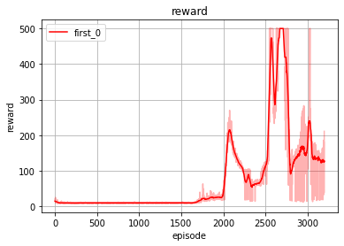
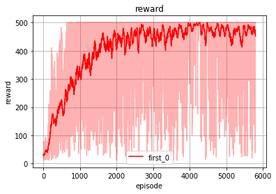
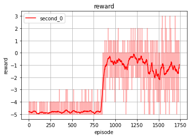
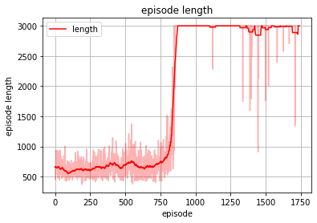
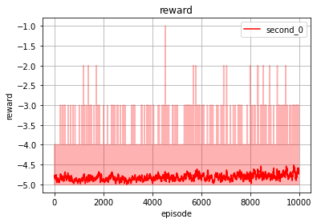
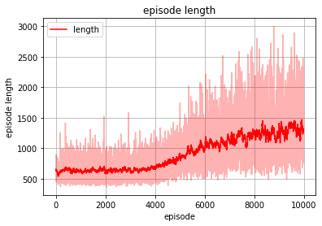

## Single-Agent Test

### CartPole-v0 (OpenAI Gym)
We train single agent in the environment with different RL algorithms.

 **DQN**:

DQN is less stable, probably needs early-stopping.

**PPO**:

PPO is more stable.

### SlimeVolley-v0 (Slime Volleyball)

**DQN**:

**PPO**:

